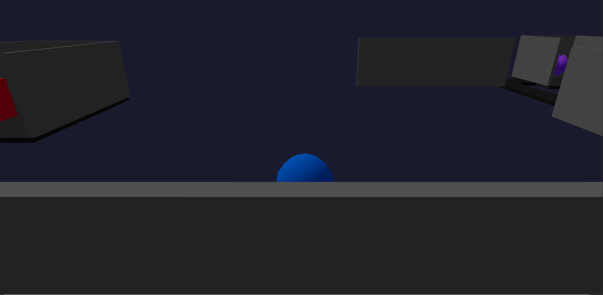

# Procedural Dungeon Crawler

A high-performance 3D first-person dungeon crawler built with modern web technologies. Explore procedurally generated dungeons, battle physics-driven enemies, and descend deeper into the abyss.



## 🚀 Features

- **Procedural Dungeon Generation:** Every run is unique with randomly generated layouts, rooms, and enemy placements.
- **Physics-Based Combat:** Real-time combat system using `@react-three/rapier` for satisfying collisions and projectiles.
- **Dynamic Enemy AI:** Encounter both melee and ranged enemies with distinct AI behaviors.
- **First-Person Experience:** Smooth 3D controls with mouse-lock and responsive movement.
- **Progression System:** Navigate through multiple floors with increasing difficulty.
- **Modern HUD:** Built with Tailwind CSS and Framer Motion for a sleek gaming interface.

## 🛠️ Tech Stack

- **Framework:** [React 19](https://react.dev/)
- **3D Engine:** [Three.js](https://threejs.org/) via [@react-three/fiber](https://r3f.docs.pmnd.rs/)
- **Physics:** [@react-three/rapier](https://pmndrs.github.io/react-three-rapier/)
- **State Management:** [Zustand](https://zustand-demo.pmnd.rs/)
- **Styling:** [Tailwind CSS](https://tailwindcss.com/)
- **Build Tool:** [Vite](https://vitejs.dev/)
- **Language:** [TypeScript](https://www.typescriptlang.org/)

## 🎮 Controls

| Action | Control |
|--------|---------|
| Move | `W` `A` `S` `D` |
| Look | `Mouse` |
| Attack | `Left Click` |
| Lock Mouse | `Click on Screen` |
| Unlock Mouse | `ESC` |

## 📦 Installation & Setup

1. **Clone the repository:**
   ```bash
   git clone https://github.com/Justin21523/procedural-dungeon-crawler.git
   cd procedural-dungeon-crawler
   ```

2. **Install dependencies:**
   ```bash
   npm install
   ```

3. **Start development server:**
   ```bash
   npm run dev
   ```

4. **Build for production:**
   ```bash
   npm run build
   ```

## 🏗️ Project Structure

- `src/systems/`: Core logic for dungeon generation and AI.
- `src/scenes/`: React Three Fiber components for the 3D world.
- `src/stores/`: Zustand state management for game state.
- `src/hooks/`: Custom hooks for combat, camera, and input.
- `src/types/`: TypeScript definitions for game entities.

## 📄 License

This project is open source and available under the MIT License.
